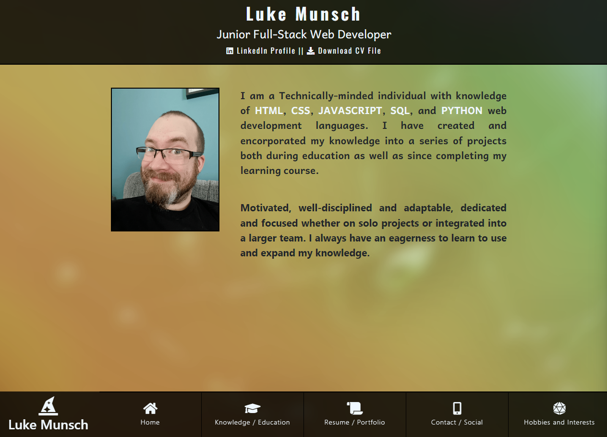
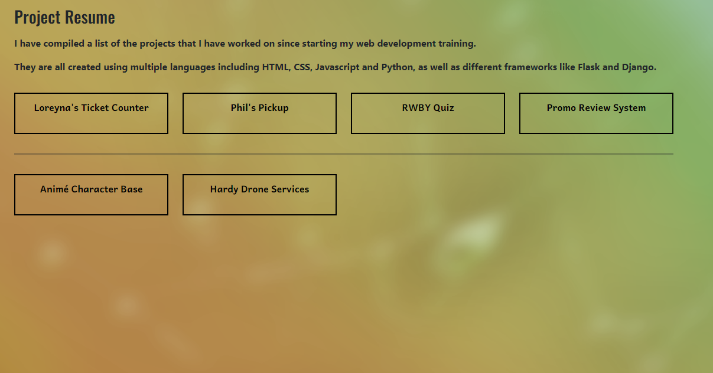
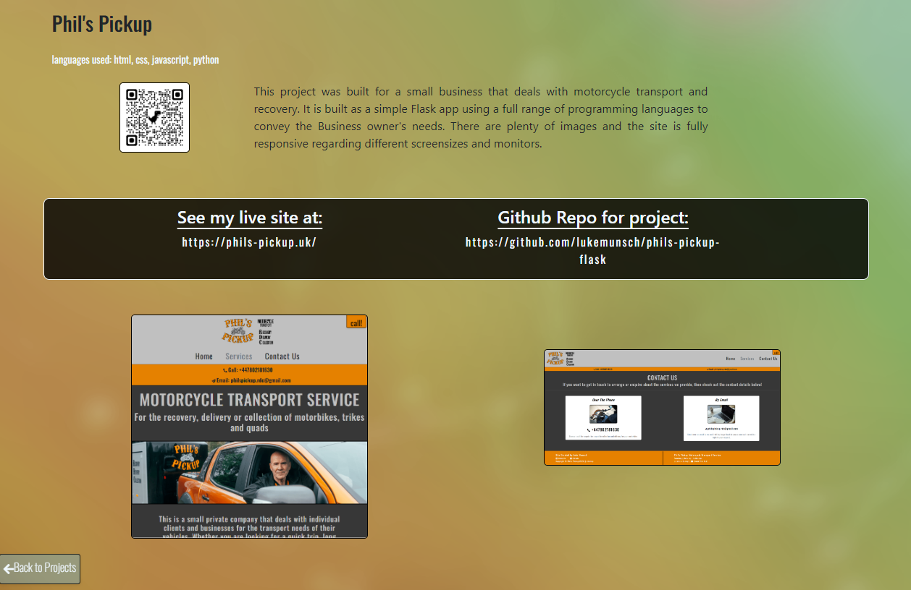
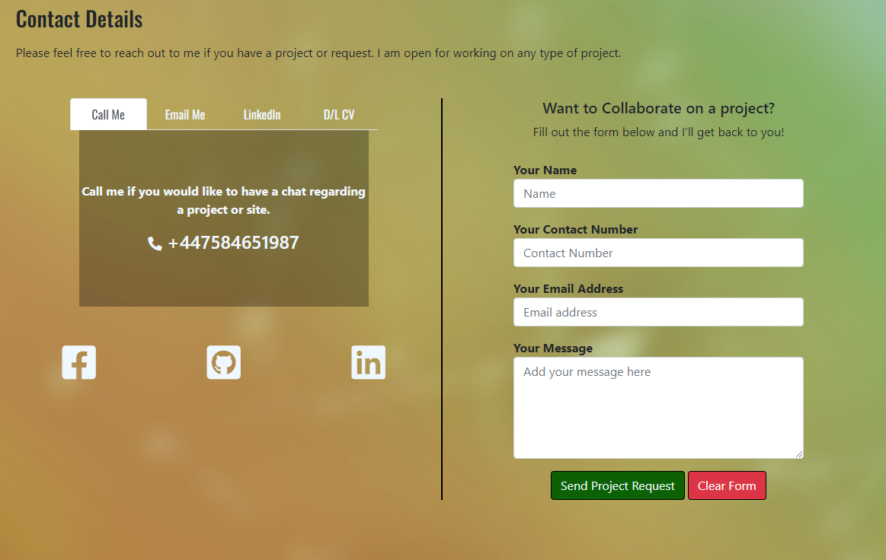
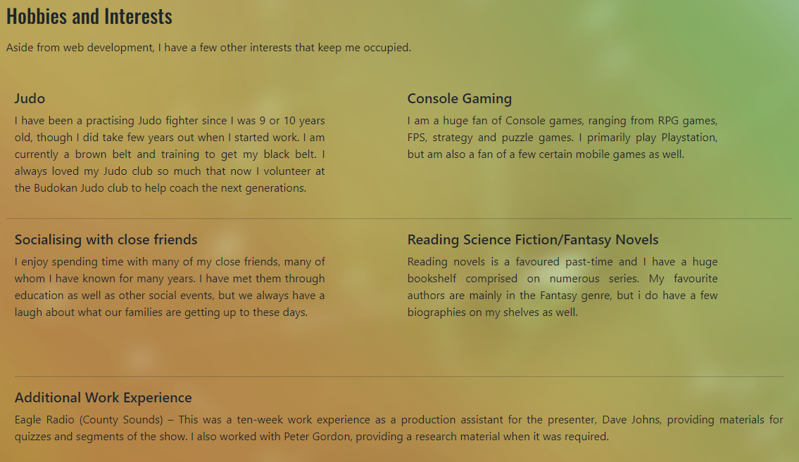

<!-- Responsive image -->

# **Luke Munsch - Junior Full Stack Web Developer Portfolio**

## # **Table of contents:**

1. [Link To Live Site](#link-to-live-site)
2. [Overview](#overview)
3. [User Stories](#user-stories)
4. [Features](#features)
   1. [Header, Menu and Index Page](#header-menu-and-index-page)
   2. [Knowledge Page](#knowledge-page)
   3. [Resume](#resume)
   4. [Project Display](#project-display)
   5. [Contact Page](#contact-page)
   6. [Interest Page](#interests-page)
5. [Testing](#testing)
   1. [HTML Testing](#html-testing)
   2. [CSS Testing](#css-testing)
   3. [PEP8 Compliance](#pep8-compliance)
6. [Unfixed Bugs](#unfixed-bugs)
7. [Deployment](#deployment)
   1. [Forking and Cloning](#forking-and-cloning)
   2. [Local Deployment](#local-deployment)
   3. [Remote Deployment](#remote-deployment)
8. [Credits](#credits)

## **Link To Live Site**

https://lukemunsch-professional-portfolio.onrender.com

## **Overview**

This is the Professional Portfolio for Luke Munsch to demonstrate the technical ability to create, manipulate and use features and pages; Combining multiple languages to produce an assortment of stylised information.

I have built this portfolio using a Django project system as the use of a database for the ever increasing resume of projects will need to be updated and the page automatically rendering the updated content.

## **User Stories**

The main purpose of my site is for people to see my "CV"; instead of creating a written document solely for people to read, I have built the CV for people to interact with and engage with the content I have included worthy of display.

On further journies to my site, there will be new content as I continue to build content; either as projects for myself or projects I have built for other people, to demonstrate my design and building skills. This will be uploaded to my site and my resume page will grow in accordance with my different projects.

[Luke Munsch Professional Portfolio](https://github.com/users/lukemunsch/projects/11)

## **Features**

### **Header, Menu and Index Page**

I created a simple header element which shows my name, job title and links to the most popular and professional sites; LinkedIn and my CV for download purposes. As I have opted for a colourful background across the main pages, I chose not to have any advanced or conflicting colours for the header; plain black with slightly off white writing, a slightly lighter hover link color compared to the standard which would have been dark blue on a background of black.

The menu I had in mind is a fixed menu at the bottom of the page; similar in style to the header at the top, simple off white writing, but i also wanted to have a clear hover diference, and chose a green hover colour which also has a transition to add some slightly more interesting style to my site.

For the main content text detailing briefly what I am all about, I again stayed with simple text and made the most important words in the sentences bold and white compared to the bulk of black writing.

### **Knowledge Page**

For my knowledge and skills page, I also encoroprated a work experience section that allows viewers to see what I have done for work previously and what education i have achieved.

I broke the page into halves; education and work experience on the left and blocks with skills below it on the right.

For the education and work experience, they are in their own blocks, back on different colours with bullet points on the left hand side of the block - giving it the appearance of a timeline.

The knowledge and education section explains what I have used and what I have knowledge of, both front-end and back-end languages.

I have also created a stack of language sliders to show the sort of levels I think my knowledge is.

### **Resume**

On the resumé page, I created a simple button arrangement for each item in the database iterated through. The buttons have a hover effect that is the same colour as the effect for text links. They have dividers between each one so that the format looks tidier.

The contents of the button are based on the friendly name for the project that is targeted. Most of the project names are no more than three words long and so they all fit in the button space nicely with text that matches with the rest of the document.

### **Project Display**

My project's display page is more advanced depending on the size of the screen; as most views on mobile wont need a qr code to be able to view it on another mobile device, I chose to hide the QR code on the actual page so that the viewers can read through the content.

The actual page is a host for the information about the project itself; the languages used for the project, a description of what the project entails, a QR code for desktop views to get it on mobiles, a link to the live site in order to interact with the site itself, a link to the guthub repo for the project in order to see the code behind the projects or clone the project if they wanted to use it themselves. I have also included a couple of screengrabs of the projects themselves so that the viewers can see what the project looks like, either on larger or smaller screens.

I wanted the page to break up a bit rather than having boring text sections, so I mimicked the header and footer by building a background around the live and guthub links.

I also included a return button so that anyone that wanted to view multiple projects would have a shortcut to go back rather than having to use the menu button at the bottom of the page. The button hovers just above the menu on larger screens and half way up the page when displaing on a mobile screen.

I also created a modal that pops up when you click on one of the images; the QR, screengrab one and (if there is one) screengrab two. The modal itself is built on a white background with a banner across the middle seperating the image on display from the selection of images. There are simple thumbnails for the images you can choose from.

### **Contact Page**

My contact page is split into two halves; We have an information on methods to contact me and links for social media on the first half, the second half is a simple contact form that sends an email using EmailJS directly to the developer.

The information for contacting the developer is displayed in a multi-tabbed box; Each tab in the header changes the information in the contents depending on what you are trying to get at. Hovering over a tab has the same efect as hovering over the other links on previous pages. The actual information on each tab has a hover effect to make the text all uppercase and black, as well as being direct links so that if you are using a mobile you can make calls and send emails and download files and link to my LinkedIn.

Under the contact information there are links to Facebook for social and Github if anyone wants to look at my full list of Repositories. This is in a similar style to the links on the resumé page.

For the contact form, it is simple headered fields with a send and clear button at the bottom of the form to submit or remove information.

### **Interests Page**

This page is less to do with coding and my web development, so the page is simple text explaining about my other interests and experiences for other work that I have done at the radio station in Guildford.

## **Testing**

Here is the generated report for each page, showing they have been passed through validators for each of their respective languages:

### **HTML Testing**

[Index Page](media/READMEImages/index-w3c.png)

[Education Page](media/READMEImages/education-w3c.png)

[Contact Page](media/READMEImages/contact-w3c.png)

[Resume Page](media/READMEImages/resume-w3c.png)

[Resume Project Page](media/READMEImages/resume-project-w3c.png)

[Interests Page](media/READMEImages/index-w3c.png)

### **CSS Testing**

[Base CSS](media/READMEImages/base-css-w3c.png)

[404 Style](media/READMEImages/404-css-w3c.png)

### **PEP8 Compliance**

I have run the code through a pep8 checker and aside from suggestions that actually ended up breaking the code, it all runs correctly without any issues.

## **Unfixed Bugs**

The Modal for the images on the project always displays the last selection image you chose, rather than displaying the picture that is clicked on; This doesn't pose much of an issue as you can still cycle through the images using the left and right buttons and you can choose a specific image to display, but i am still investigating why this doesn't operate correctly.

## **Deployment**

To deploy Luke's Professional Portfolio, allow other people to run the app and see it working, there are 3 methods to allow you to complete these actions:

### **Forking and Cloning**

Accessing GitHub and navigating to my repositories will allow users to copy my code directly from the source, either by forking or cloning: Accessing the Professional Portfolio repository and clicking on the code button next to Gitpod link will bring up a menu to create a repository of your own in your own GitHub repo. There is also the Download zip file option which will allow you to save a copy of my code as well.

### **Local Deployment**

For local deployment of Luke's Professional Portfolio, I will be using the VS Code project to edit and run my workspace;
- From GitHub, once the repository has been created (either as a new project or by forking/cloning) I will then load VS Code with a new window and using the command pallette I will clone the repository, which pulls the information down from Github to my new window. I can then save the information to a new folder on my local harddrive instead of requiring a pull each time from Github.
- You will also need to complete the installation of packages that I have created in the current version of the site to your lcoally created virtual environments

        pip3 install -r requirements.txt

- We need to set up some of the environmental variables that are used on our site, but due to the nature of secret codes that external users should NOT know about, we keep them in an env.py file and declare it in the .gitignore file to avoid the secrets being made less secret. An example of an env.py file is as such;

      import os

         os.environ['DEVELOPMENT']="True"
         os.environ['SECRET_KEY']="secret_key_value_here"
         os.environ['DATABASE_URL']="db_value_here"

### **Remote Deployment**

For the deployment of Luke's Professional Portfolio, there are several steps required for completing deployment;

- We are using the site Render for out deployment;
   - In render dashboard, crete a new Web Service and give it a name befitting your project. You can use the same name as your Github Repo.
- We need to make sure that a couple of our environmental variables are added to the Environment section in the new Web Service.
   - Adding the variables for our secret key and our Database url, *the details must match what we have added to the env.py from the local deployment section.*
- We will need to make sure our resources are arranged for the deployment of our app;

      pip3 install gunicorn
      pip3 install dj_database_url
      pip3 install psycopg2-binary

      pip3 freeze> requirements.txt

- As we have chosen Render for our hosting site, we will need to set up our database.
   - In the Render app settings page we need to tell Render how to deploy the site, so we add this insert to the build command;

      $ ./build.sh

   - We need to add an insert to the Start command;

      $ gunicorn <Project_name>.wsgi:application

- Because of the start command using ./build.sh, we need to create a file in our root directory with a build.sh file. In order for the app to deploy correctly, in this new build.sh file, we can add;

      set -o errexit
      pip install -r requirements.txt
      python manage.py collectstatic --noinput
      python manage.py makemigrations && python manage.py migrate

- In order for our media and static files to be served, we have to add a new service called Amazon Web Service (AWS), but will require a few settings;

   - First, log in to the AWS dashboard and set up your bucket.

   - You will end up producing an excel document that contains secret values that we need to use in Render to see our media.

   - Add the following KEY: Value variables to the Render Config Vars;

      AWS_ACCESS_KEY_ID : 'value'
      AWS_SECRET_ACCESS_KEY : 'value'
      USE_AWS : True

With these in place, you should now be able to produce and host a version of my portfolio.

## **Credits**

- Huge thanks to the Code institute with whose education and course have enabled me to understand and produce this piece of work.
- Thanks to the members of Slack who have assisted me with helpful tips and tricks
- Stack overflow has also bee crucial to assisting with more advanced queries that I came across in my building process.
- Font awesome has been used to produce icons I have used throughout my project.
- Google fonts was used to produce a variety of fonts to add further style to my project.
- A huge thanks to W3schools.com for providing instructional information on how to create a lightbox to display images in my resume display page. They also provided information on how to create the Contact information collection in the tabbed header box.

