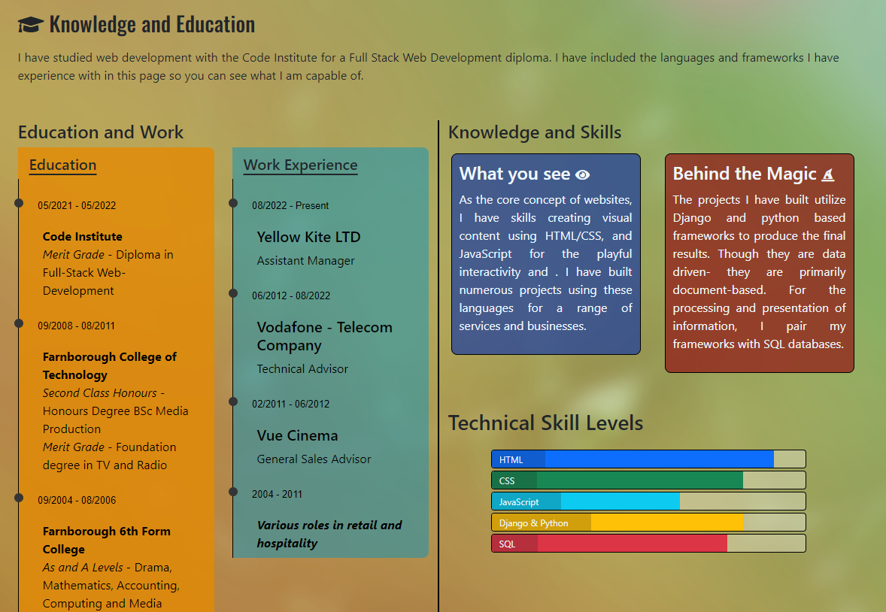

<!-- Responsive image -->

# Luke Munsch - Junior Full Stack Web Developer Portfolio

## # Table of contents:

1. [Link To Live Site](#link-to-live-site)
2. [Overview](#overview)
3. [User Stories](#user-stories)
4. [Features](#features)
   1. [Header, Menu and Index Page](#header-menu-and-index-page)
5. [Testing](#testing)
   1. [Lighthouse Reports](#lighthouse-reports)
6. [Unfixed Bugs](#unfixed-bugs)
7. [Deployment](#deployment)
8. [Credits](#credits)

## Link To Live Site

https://lukemunsch-professional-portfolio.onrender.com

## Overview

This is the Professional Portfolio for Luke Munsch to demonstrate the technical ability to create, manipulate and use features and pages; Combining multiple languages to produce an assortment of stylised information.

I have built this portfolio using a Django project system as the use of a database for the ever increasing resume of projects will need to be updated and the page automatically rendering the updated content.

## User Stories

The main purpose of my site is for people to see my "CV"; instead of creating a written document solely for people to read, I have built the CV for people to interact with and engage with the content I have included worthy of display.

On further journies to my site, there will be new content as I continue to build content; either as projects for myself or projects I have built for other people, to demonstrate my design and building skills. This will be uploaded to my site and my resume page will grow in accordance with my different projects.

[Luke Munsch Professional Portfolio](https://github.com/users/lukemunsch/projects/11)

## Features

### Header, Menu and Index Page

I created a simple header element which shows my name, job title and links to the most popular and professional sites; LinkedIn and my CV for download purposes. As I have opted for a colourful background across the main pages, I chose not to have any advanced or conflicting colours for the header; plain black with slightly off white writing, a slightly lighter hover link color compared to the standard which would have been dark blue on a background of black.

The menu I had in mind is a fixed menu at the bottom of the page; similar in style to the header at the top, simple off white writing, but i also wanted to have a clear hover diference, and chose a green hover colour which also has a transition to add some slightly more interesting style to my site.

For the main content text detailing briefly what I am all about, I again stayed with simple text and made the most important words in the sentences bold and white compared to the bulk of black writing.

### Knowledge Page

For my knowledge and skills page, I also encoroprated a work experience section that allows viewers to see what I have done for work previously and what education i have achieved.

I broke the page into halves; education and work experience on the left and blocks with skills below it on the right.

For the education and work experience,  they are in their own blocks, back on different colours with bullet points on the left hand side of the block - giving it the appearance of a timeline.

The knowledge and education section explains what I have used and what I have knowledge of, both front-end and back-end languages.

### Resume

On the resumé page, it is a simple button 

### Project Display

### Contact Page

### Interests Page

## Testing

Here is the generated report for each page, showing they have been passed through validators for each of their respective languages:

### HTML Testing

[Index Page](media/READMEImages/index-w3c.png)

[Education Page](media/READMEImages/education-w3c.png)

[Contact Page](media/READMEImages/contact-w3c.png)

[Resume Page](media/READMEImages/resume-w3c.png)

[Resume Project Page](media/READMEImages/resume-project-w3c.png)

[Interests Page](media/READMEImages/index-w3c.png)

### CSS Testing

[Base CSS](media/READMEImages/base-css-w3c.png)

[404 Style](media/READMEImages/404-css-w3c.png)

### PEP8 Compliance

## Unfixed Bugs

<!-- Is there any -->

## Deployment

<!-- How -->

## Credits

<!-- All the things you have get/find/learn -->
